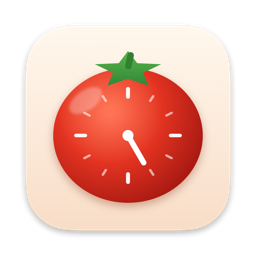
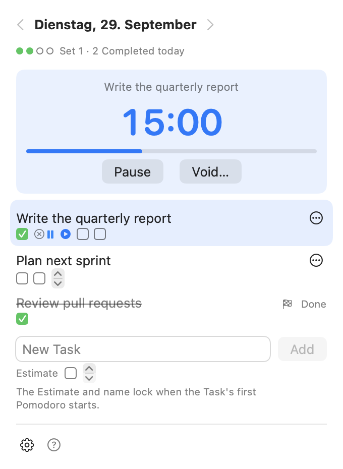

# Pomopomo

A menu-bar app for the Mac that follows Francesco Cirillo's Pomodoro Technique as the book describes it, relaxed in a few deliberate places. Instead of throwing away an interrupted Pomodoro, it lets you pause it and leaves an honest record of every rule you bent.



## How it works

- **Plan the Day.** Add Tasks with an Estimate: how many Pomodoros you expect each to take. Each Estimate shows as a row of boxes, like Cirillo's paper sheet. The Estimate and the name lock when the Task's first Pomodoro starts.
- **Work in Pomodoros.** Start one on a Task and focus for 25 minutes. Completed Pomodoros fill the boxes. You can pause a Pomodoro, and the Mac going to sleep pauses it too. You can also void one; a Voided Pomodoro counts toward nothing.
- **Take the Breaks.** A Short Break follows each Completed Pomodoro, and a Long Break follows each Set of four.
- **Mark Tasks Done.** Done is final: extra work goes into a new Task.
- **Look back.** Every Day is kept. Browse past Days with ← and →. Each one opens with a summary: Pomodoros Completed and Voided, Marks, and Tasks Done.

Bending a rule is allowed but visible. A Pomodoro gets a **Mark** when it was paused, went beyond its Task's Estimate, or skipped a Break. Marks never change what counts. The **?** button in the popover explains every symbol.

The words in the app (Day, Task, Estimate, Pomodoro, Completed, Voided, Done, Mark…) have exact meanings, written down in [CONTEXT.md](CONTEXT.md). The reasons behind the bigger choices are in [docs/adr](docs/adr).

## Keyboard shortcuts

| Key | Action |
| --- | --- |
| Space | Pause or resume the Pomodoro |
| ← / → | Previous or next Day |
| ⌘N | New Task |
| ⌘T | Back to today |
| ⌘, | Settings |
| ⌘Q | Quit |

## Settings

The lengths of a Pomodoro, a Short Break and a Long Break, the size of a Set, whether a sound plays when a Pomodoro or Break ends, and how much time the menu bar shows. A Pomodoro or Break keeps the length it started with.

## Your data

Everything stays on your Mac, in `~/Library/Application Support/Pomopomo/logbook.json`. There are no accounts and no syncing.

## Building

You need macOS 14 or later, Xcode, and [XcodeGen](https://github.com/yonaskolb/XcodeGen) (`brew install xcodegen`).

```bash
make run    # generate the Xcode project, build a Release app and open it
make app    # build only, into build/Build/Products/Release/Pomopomo.app
make test   # run the PomopomoCore tests
make icon   # redraw the app icon from tools/make-icon.swift
```

The rules of the method live in `PomopomoCore`, a Swift package with its own tests. The SwiftUI app in `App/` connects them to the clock, the menu bar, notifications and the file on disk.
